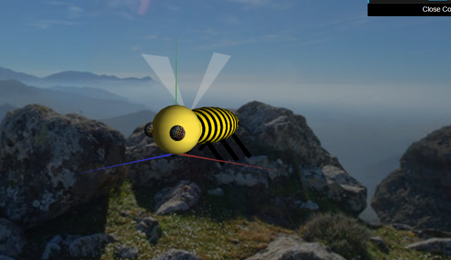

# CG 2023/2024
## Group T01G08
| Name                                       | Number    | E-Mail                   |
| ----------------                           | --------- | ------------------       |
| Florentia-Styliani Diamantopoulou          | 202311353 | up202311353@edu.fe.up.pt | 
| Maria Mitkou                               | 202311354 | up202311354@edu.fe.up.pt | 

----
## Project Notes
### Sphere

### Panorama

### Flower Garden

### Rocks

### Bee

### Controlling the bee with W,S,R keys
Animation was done with the update method of CGF library and the animation speed depends on time (delta):
- **W key**: Bee accelerates
- **S key**: Bee brakes
- **R key**: Bee returns to its initial speed, angle, position

### Pollen and Hive Animation the bee with F,P,O keys
- **F key**: Bee descends to a flower and obtains its pollen
- **P key**: Bee returns to its initial height
- **O key**: Bee ascends to hive and drops the pollen

### Grass 
