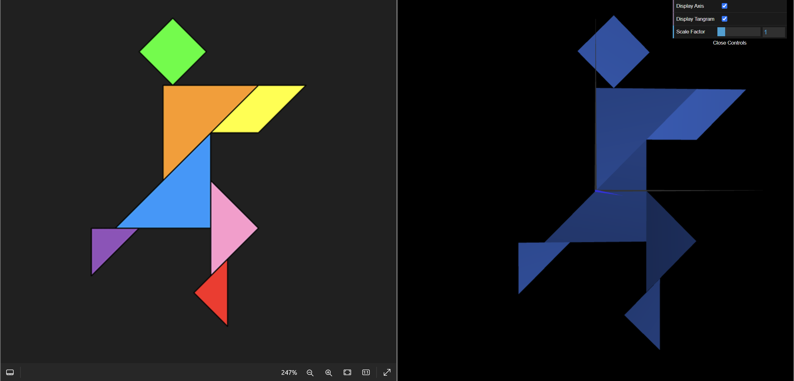

# CG 2023/2024

## Group T01G08

## TP 2 Notes Tangram

- In the exercises we learned how to use matrix multiplication operations such as scaling, rotation, tranforming and placing multiple objects at the same plane to create our own tangram. 
-We had some difficulties with the geometry of the tangram.

