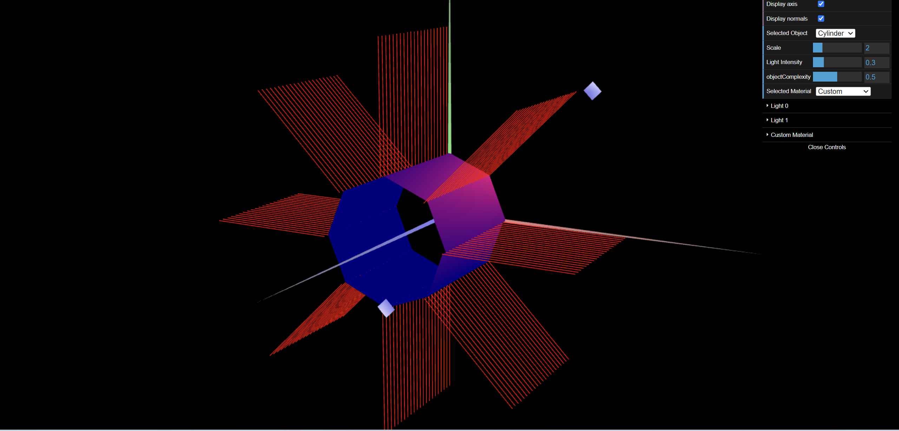

# CG 2023/2024

## Group T01G08

## TP 3 Notes  Cylindrical Surface - Application of Gouraud shading - Exercise 3

- At this exercice we learned how to simplify normals and vertices for them to be on one point.

