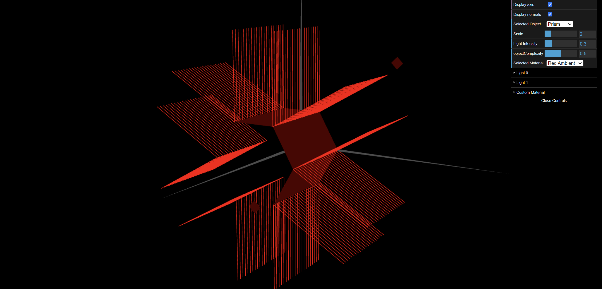

# CG 2023/2024

## Group T01G08

## TP 3 Notes Lighting and Materials - Exercise 2

- At this exercice we learned how to implement two normals at the same point and also creating different stacks.

